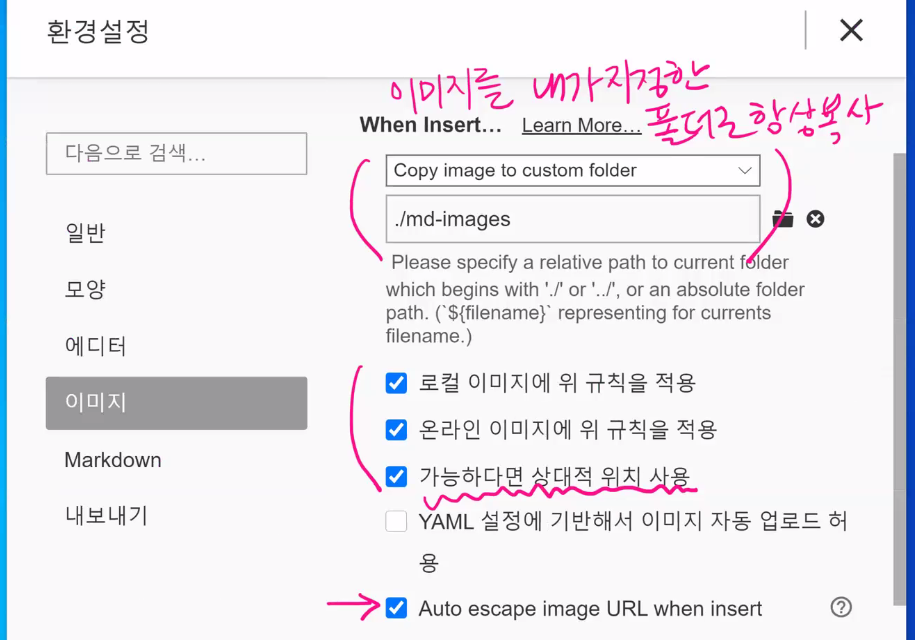

## markdown

> 매우 가벼운 텍스트를 구조화하는(markup) 언어


## 제목(heading)

문서의 제목을 나타내기 위해 사용되며, #을 통해 제목의 수준(level)을 정한다.

## 제목3

### h4

#### h5

###### h6

## 목록

- 순서가 없는 목록(unordered list)
- 순서가 없는 목록입니다.
  - tab을 누르면, 하위 목록을 작성할 수 있습니다.

- shift+tab 하시면 상위목록을 작성할 수 있습니다.


1. 순서가 있는 목록(ordered list)
2. 순서가 있습니다.
   1. 하위 목록을 작성할 수 있씁니다.
   2. 계속...


## 코드블록 

코드블록은 backtick(`) 3개로 구성되며, 특정 언어를 갈아타기 용이하다. syntax highlighting

예시)

```python
print('hi')
#주석
```


```python
print('hello_world')
```


```html
#주석인가?
<!-- 주석이다. -->
```


## 인라인 코드블록

backtick(`)을 하나로 문장 내에 있는 코드(함수이름 등)를 블록화할 때 사용

ex)  `random` 모듈을 활용하는것을 배웠다. `print`함수는 출력할 때 사용한다. `if`는 조건문에서 사용되며, 다중조건을 할 때는 elif를 쓴다. 


## 표(table)

 

| 이름   | 출석 |      |
| ------ | ---- | ---- |
| 홍길동 | v    |      |
| 김철수 | v    |      |
| 이영희 | v    |      |


## 이미지


- Typora에 아래처럼 설정하면, 자동으로 특정 폴더에 상대경로로 입력된다.
- 

- 절대경로 - C:\User\lec\Desktop\1.png

- 상대경로 - md - images/1.png 


## 링크

[구글](https://google.com)


## 인용문

> 인용, 정의 / 정리  

   `>` 부등호 표시로 인용문 생성

## 기타

- 수직선 `-`3개

---

- 기울임(이탤릭) `*`로 감싸기

  *기울임*

- 굵게(볼드) **로 감싸기**

  **굵게 **

-  취소선 ~~로 감싸기

  ~~취소선~~


# TIL (Today I Learned)

